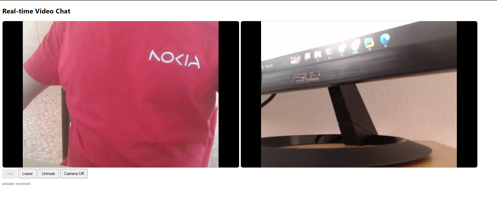
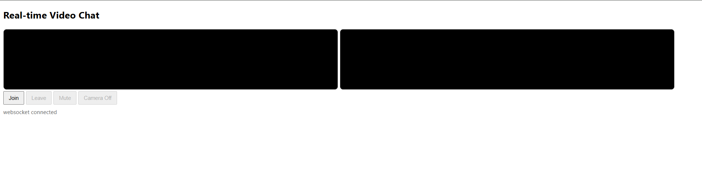
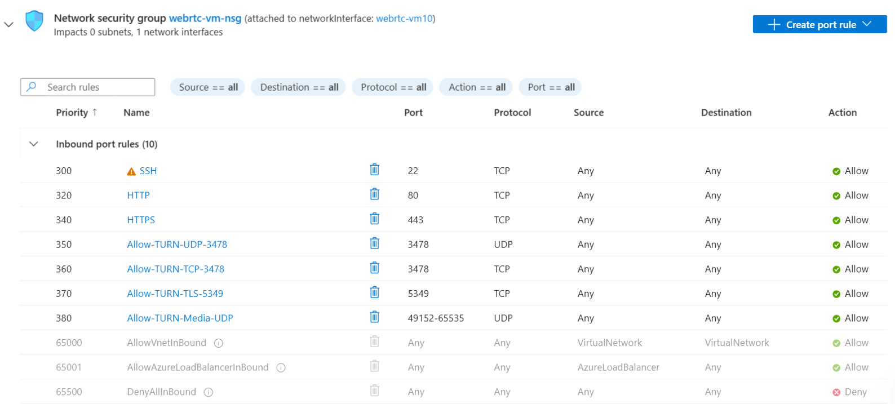

# 📹 Real-Time Video Chat (WebRTC + Django + Coturn)

  
*A running instance of the app showing two browser peers connected in real time.*

---

## 📖 **Introduction**

This project demonstrates how to build and deploy a **real-time video communication platform** using **WebRTC**, **Django**, **Daphne**, **Nginx**, and a **TURN server (Coturn)** on a cloud virtual machine (Azure VM in our case).  

The goal of this project is simple:  
👉 Establish a **live video chat between two browsers** — even if they are behind firewalls, NATs, or mobile networks.  

At its core, the application follows the WebRTC principle:  
- First, two peers connect through a **signaling server** (here implemented with Django + WebSockets).  
- Once signaling is complete, the peers try to establish a **direct peer-to-peer connection**.  
- If the network environment blocks direct connections, the media streams are relayed through a **TURN server (Coturn)** running on the VM.  

This ensures that communication succeeds in **all scenarios** — whether the peers are on the same Wi-Fi, on mobile data, or behind strict NATs.  

---

### 🔹 **Demo: Before and After Connection**

To illustrate this, let’s walk through the two main states of the application:

#### 1. **Initial State — No Connection Yet**



When the application first loads in the browser:  
- The two video windows (left for **local stream**, right for **remote stream**) appear as empty black rectangles.  
- The **Join** button is active, allowing the user to enter the video chat room.  
- The message `websocket connected` confirms that the browser has successfully connected to the Django signaling server.  
- However, no media streams are flowing yet, since no peer-to-peer connection has been established.  

This is the **waiting stage**, where signaling is ready, but the actual call has not started.

---

#### 2. **Active State — Live Video Chat**


After two peers join the same room:  
- The **left window** displays the user’s local camera feed.  
- The **right window** displays the remote peer’s camera feed.  
- Additional controls (Leave, Mute, Camera Off) become available.  
- The message `answer received` shows that WebRTC’s offer/answer handshake has succeeded.  

From this point, audio and video flow directly between the peers:  
- If direct P2P is possible, it will be used.  
- If not, media is automatically relayed through the Coturn server.  

This proves the system works both in **ideal conditions** (direct peer-to-peer) and in **challenging network conditions** (with TURN relay).  

---

🔹 **Current Limitations**  
At this stage, the application represents the **most rudimentary version** of a WebRTC communication system:  
- It currently supports only **one hard-coded room** where peers can join.  
- The backend is running with a **single Daphne worker instance** (one ASGI worker), which is enough for basic testing but not optimized for scaling.  
- This design is deliberate, focusing on simplicity to clearly demonstrate the core concepts of signaling, peer connection, and TURN relay.  

In the future, this foundation can be expanded into a more sophisticated system that supports:  
- Multiple dynamic rooms (allowing many meetings to take place simultaneously).  
- Scaling with additional Daphne workers and load balancing.  
- Better session management, authentication, and user roles.  

For now, this raw, minimal setup is ideal for understanding the **essentials of real-time browser-to-browser communication** before moving toward more complex deployments.

---
## 📂 Project Structure
The repository is organized as follows:

```bash
webrtc_repo/
├── manage.py              # Django management script
├── requirements.txt       # Python dependencies
├── static/                # Frontend static assets (served via Django/Nginx)
│   ├── css/
│   │   └── styles.css     # UI styling for video chat page
│   └── js/
│       └── app.js         # WebRTC logic (signaling, ICE, media handling)
├── staticfiles/           # Collected static files (after `python manage.py collectstatic`)
├── templates/
│   └── index.html         # Main HTML page with video elements & controls
└── webrtc/                # Django application for signaling
    ├── __init__.py
    ├── asgi.py            # ASGI entrypoint (used by Daphne)
    ├── consumers.py       # WebSocket consumers (handle signaling messages)
    ├── routing.py         # WebSocket routing configuration
    ├── settings.py        # Django project settings
    ├── urls.py            # HTTP routes
    └── wsgi.py            # WSGI entrypoint (not used in Daphne, kept for completeness)


```
---

## 🌍 **Why This Project?**

- **WebRTC** is the standard for real-time communication on the web.  
- By default, WebRTC tries to connect browsers directly (**peer-to-peer**).  
- But direct connections don’t always work — for example, when both peers are behind strict NATs or mobile carriers.  
- That’s where a **TURN server** comes in: it relays media through a trusted server so that the call always succeeds.  

This project implements both:  
- ✅ **Direct peer-to-peer connections** (fastest, lowest latency).  
- ✅ **TURN-assisted relay connections** (fallback when direct P2P fails).  

No matter the scenario, your browsers will stay connected.  

---

## 🛠️ **Technologies Used**

- **Django** → backend for signaling (exchange of offer/answer/ICE candidates).  
- **Daphne** → ASGI server for running Django with WebSockets.  
- **Nginx** → reverse proxy, TLS termination, and static file hosting.  
- **Coturn** → TURN/STUN server to relay media if direct P2P fails.  
- **Azure VM** → deployment environment (you can also use AWS, GCP, or any VPS).  
- **Custom Domain + TLS (Let’s Encrypt)** → secure HTTPS and WSS connections.  

---

## 🌐 **Azure VM Network Configuration**

In addition to deploying Django, Nginx, and Coturn on the VM, it is crucial to configure the **network security rules** so that signaling and media traffic can flow properly.  

Below is the screenshot of the inbound port rules defined in the **Azure Network Security Group (NSG)** for this project:



---

### 🔎 **Explanation of Port Rules**

- **Port 22 (SSH, TCP)**  
  Allows remote administrative access to the VM. ⚠️ Use carefully and restrict access to trusted IPs where possible.  

- **Port 80 (HTTP, TCP)**  
  Serves unencrypted web traffic. Mainly used for HTTP → HTTPS redirection.  

- **Port 443 (HTTPS, TCP)**  
  Serves secure web traffic. Required for Django/Nginx to handle signaling and static content via **HTTPS**.  
  Without HTTPS, browsers will block camera/microphone access.  

- **Port 3478 (UDP + TCP, TURN/STUN)**  
  Standard STUN/TURN port. Used by Coturn to negotiate NAT traversal and relay media when necessary.  
  Both **UDP** and **TCP** are enabled for reliability across different networks.  

- **Port 5349 (TCP, TURN over TLS)**  
  Provides TURN services wrapped in TLS (`turns:`). This is useful when firewalls block plain UDP/TCP traffic on 3478.  

- **Ports 49152–65535 (UDP, TURN Media Relay)**  
  High UDP port range reserved for relaying actual audio/video streams when using the TURN server.  
  These ports carry the **real media flow** once the WebRTC session is active and P2P is not possible.  

- **Other defaults (Azure internal rules)**  
  - `AllowVnetInBound` → internal Azure communication.  
  - `AllowAzureLoadBalancerInBound` → Azure health checks.  
  - `DenyAllInBound` → blocks all other inbound traffic not explicitly allowed.  

---

### 🔄 **How Media Flow Works**

1. **Signaling (WebSockets over 443)**  
   - Peers exchange SDP offers/answers and ICE candidates via Django running behind Nginx on port **443**.  

2. **Connection Attempt (STUN/TURN on 3478 or 5349)**  
   - If direct peer-to-peer is possible, browsers establish a connection using STUN.  
   - If not, Coturn relays traffic via TURN (UDP 3478, TCP 3478, or TLS 5349).  

3. **Media Relay (UDP 49152–65535)**  
   - Once TURN relay is selected, actual **audio/video packets** are sent over this high UDP port range.  

This setup ensures that **all types of networks are supported** — from home Wi-Fi to restrictive corporate firewalls.

---

### 🖥️ **Equivalent UFW Commands**

If you are not using the Azure Portal and prefer to configure ports directly on Ubuntu with `ufw`, you can replicate the same rules with:

```bash
# Basic web + SSH
sudo ufw allow 22/tcp
sudo ufw allow 80/tcp
sudo ufw allow 443/tcp

# Coturn STUN/TURN
sudo ufw allow 3478/udp
sudo ufw allow 3478/tcp
sudo ufw allow 5349/tcp

# TURN media relay
sudo ufw allow 49152:65535/udp

# Apply changes
sudo ufw reload


```
---
## 🚀 **Deployment Overview**

Deploying this project correctly is one of the most important steps, because real-time communication in the browser requires **secure contexts (HTTPS/WSS)**. Without HTTPS, modern browsers will block access to the **camera** and **microphone**, which means WebRTC cannot function. In addition, the TURN server itself may also rely on valid TLS certificates to handle secure media relays (`turns:` connections over TCP/TLS).  

This application has been successfully deployed on a real domain with TLS certificates, ensuring global availability over **HTTPS** and **WSS**. Anyone replicating this project can achieve the same by following three main steps:

---

### 1️⃣ **Register Your Own Domain**
- You can purchase or claim any domain name from a registrar (e.g., Namecheap, Google Domains, GoDaddy, DotTech).  
- Once registered, configure your DNS records to point the domain (e.g., `yourdomain.com`) to your VM’s **public static IP address** (from Azure, AWS, or GCP).  
- This mapping ensures that requests to `https://yourdomain.com` are routed to your VM.

---

### 2️⃣ **Secure It with SSL/TLS Certificates**
- Since WebRTC requires secure HTTPS/WSS, you must obtain valid SSL certificates. Without them, the browser will refuse access to the camera and microphone.  
- The simplest way is to use **Let’s Encrypt**, which provides free TLS certificates.  
- On your VM, you can install and register certificates directly using **Certbot**:

```
  sudo apt update
  sudo apt install certbot python3-certbot-nginx -y
  sudo certbot --nginx -d yourdomain.com -d www.yourdomain.com

```
## 🔐 Configuration Files (Nginx, Daphne, Coturn)

To secure communication with **TLS/SSL certificates** and to keep all services working reliably, the following configurations were used.  
Sensitive values (domain, username, password) are replaced with placeholders.
---
### 1️⃣ Nginx Configuration

Path: `/etc/nginx/sites-available/webrtc.conf`

```
server {
    listen 80;
    server_name yourdomain.com www.yourdomain.com;

    location /.well-known/acme-challenge/ {
        root /var/www/certbot;
    }

    location / {
        return 301 https://$host$request_uri;
    }
}

server {
    listen 443 ssl http2;
    server_name yourdomain.com www.yourdomain.com;

    ssl_certificate /etc/letsencrypt/live/yourdomain.com/fullchain.pem;
    ssl_certificate_key /etc/letsencrypt/live/yourdomain.com/privkey.pem;

    # WebSocket proxying to Daphne
    location /ws/ {
        proxy_pass http://127.0.0.1:8001;
        proxy_http_version 1.1;
        proxy_set_header Upgrade $http_upgrade;
        proxy_set_header Connection "upgrade";
        proxy_set_header Host $host;
    }

    # Django static files
    location /static/ {
        alias /home/<app_user>/webrtc_repo/staticfiles/;
    }

    # Pass all other requests to Django/Daphne
    location / {
        proxy_pass http://127.0.0.1:8001;
        proxy_set_header Host $host;
        proxy_set_header X-Forwarded-For $proxy_add_x_forwarded_for;
    }
}

```
---
## 🔐 Daphne configuration
```
[Unit]
Description=Daphne ASGI server for WebRTC project
After=network.target

[Service]
User=<app_user>
Group=www-data
WorkingDirectory=/home/<app_user>/webrtc_repo
ExecStart=/home/<app_user>/webrtc_repo/.venv/bin/daphne -b 127.0.0.1 -p 8001 webrtc.asgi:application
Environment="DJANGO_SETTINGS_MODULE=webrtc.settings"
Restart=always

[Install]
WantedBy=multi-user.target

```
Enable and start:
```
sudo systemctl daemon-reload
sudo systemctl enable daphne
sudo systemctl start daphne
```

## Coturn Configuration


```
# /etc/turnserver.conf
listening-port=3478
tls-listening-port=5349

listening-ip=YOUR_PRIVATE_VM_IP
relay-ip=YOUR_PRIVATE_VM_IP
external-ip=YOUR_PUBLIC_VM_IP/YOUR_PRIVATE_VM_IP

realm=yourdomain.com
fingerprint
use-auth-secret
static-auth-secret=REPLACE_WITH_LONG_RANDOM_BASE64
stale-nonce

cert=/etc/letsencrypt/live/yourdomain.com/fullchain.pem
pkey=/etc/letsencrypt/live/yourdomain.com/privkey.pem

min-port=49152
max-port=65535
```
Systemd service (enabled by default after install):

```
sudo systemctl enable coturn
sudo systemctl start coturn
```

## ⚡ Quickstart (Production)

```
# 1) Clone & Python env
git clone https://github.com/you/webrtc_repo.git
cd webrtc_repo
python3 -m venv .venv && source .venv/bin/activate
pip install -r requirements.txt

# 2) Django settings
# Edit webrtc/settings.py or use env vars:
#   DEBUG=False
#   ALLOWED_HOSTS=["yourdomain.com","www.yourdomain.com"]
#   CSRF_TRUSTED_ORIGINS=["https://yourdomain.com","https://www.yourdomain.com"]

# 3) Static files for Nginx
python manage.py collectstatic --noinput

# 4) Start services
sudo systemctl restart daphne
sudo systemctl restart nginx
sudo systemctl restart coturn
```

Open https://yourdomain.com on two devices and click **Join**.

--- 
### ✅ How to Verify (HTTPS, WebSockets, TURN vs P2P)

1. **Secure Context**
   - Address bar shows 🔒 and page loads over `https://`.
   - In DevTools → Network, the WebSocket endpoint `/ws/...` is **wss://** with **101 Switching Protocols**.

2. **Peer Connection Health**
   - Visit `chrome://webrtc-internals` (or Firefox `about:webrtc`).
   - Start a call on two devices, then check:
     - `iceConnectionState` → **connected**/**completed**.
     - **Selected candidate pair**:
       - `typ=host` or `srflx` → **direct P2P**.
       - `typ=relay` (and `relayProtocol=udp/tcp/tls`) → **TURN relay**.

3. **Force TURN for testing**
```js
   const pc = new RTCPeerConnection({
     iceServers: [ /* your TURN config only */ ],
     iceTransportPolicy: 'relay'
   });
```

---
## 🧰 Troubleshooting (Symptoms → Fix)

- **Black remote video, audio OK**
  - Likely ICE mismatch or blocked media ports. Confirm `typ=relay` in webrtc-internals.
  - Check NSG/UFW rules for **UDP 49152–65535** and TURN `3478/udp`, `3478/tcp`, `5349/tcp`.
  - Verify `external-ip=PUBLIC/PRIVATE` is correct in `/etc/turnserver.conf` and restart coturn.

- **“WebSocket not connected” or 400/403 on `/ws/`**
  - Nginx `location /ws/` must proxy with `Upgrade`/`Connection: upgrade`.
  - Daphne must listen on **127.0.0.1:8001** (matches Nginx).
  - Check: `sudo journalctl -u daphne -e` and `sudo tail -f /var/log/nginx/error.log`.

- **Camera/mic prompt never appears**
  - Page not served over HTTPS (secure context). Fix TLS, then reload.
  - Browser permission previously denied → clear site permissions.

- **Calls work on laptops but fail on mobile data**
  - Mobile carriers often require **TURN over TLS (5349/tcp)**.
  - Ensure cert paths in coturn config are valid and not expired.

- **Static files 404**
  - Run `python manage.py collectstatic --noinput`.
  - Ensure Nginx `location /static/` points to your `staticfiles/` directory and www-data can traverse parent dirs (ACL or perms).

---
## 🛠️ Operations & Maintenance

### Certificates
- Let’s Encrypt auto-renew (via `certbot.timer`). Confirm with:

```
  sudo systemctl status certbot.timer
  sudo certbot renew --dry-run
```
After renewal, reload Nginx and (if using turns:) restart coturn:
```
sudo systemctl reload nginx
sudo systemctl restart coturn
```
# Logs
```
sudo journalctl -u daphne -e
sudo journalctl -u coturn -e
sudo tail -f /var/log/nginx/access.log /var/log/nginx/error.log
```

## Service control
```
sudo systemctl restart daphne
sudo systemctl restart coturn
sudo systemctl reload nginx
```

Backups

Keep a safe copy of:

/etc/letsencrypt/live/yourdomain.com/ (certs)

/etc/nginx/sites-available/webrtc.conf

/etc/turnserver.conf

The repo (git tag working releases).

Security Notes

Set DEBUG=False, restrict ALLOWED_HOSTS, and hide Django SECRET_KEY.

Treat TURN credentials (TURN_USER, TURN_PASS) as secrets; rotate if leaked.

Consider basic rate-limiting in Nginx for /ws/ and / to reduce abuse.

## 🧪 Local Development (No TLS)
```
# in one terminal
python manage.py runserver 0.0.0.0:8000
# in the template, ws:// is fine for http://localhost
```

Some mobile devices require HTTPS to access camera/mic. For full parity, use a dev certificate or run via your Nginx reverse proxy locally.

---
## 🧭 Browser Support & Known Issues
```
- Tested on latest **Chrome** and **Firefox** (desktop + Android). iOS Safari requires HTTPS and user gesture to autoplay.
- Network-restricted environments may force **TURN relay** and increase latency.
```

## 🔒 TURN Credentials: Secure Setup (Avoid hard-coded creds in JS)

**Don’t ship static TURN creds in `app.js`.** They’re visible to everyone and your server will be abused.

### Recommended (Time-limited REST credentials)
1) **Coturn config** (`/etc/turnserver.conf`):

```
realm=yourdomain.com
fingerprint
use-auth-secret
static-auth-secret=REPLACE_WITH_LONG_RANDOM_BASE64
stale-nonce

listening-port=3478
tls-listening-port=5349
cert=/etc/letsencrypt/live/yourdomain.com/fullchain.pem
pkey=/etc/letsencrypt/live/yourdomain.com/privkey.pem
min-port=49152
max-port=65535
```

> Note: remove any `user=…` lines when using `use-auth-secret`.

2) **Backend endpoint** (Django) to mint creds on demand:
```python
# views.py
import base64, hmac, hashlib, time, os
from django.http import JsonResponse

TURN_SECRET = os.environ.get("TURN_STATIC_AUTH_SECRET")  # same as static-auth-secret
TURN_URLS = [
    "stun:yourdomain.com:3478",
    "turn:yourdomain.com:3478?transport=udp",
    "turn:yourdomain.com:3478?transport=tcp",
    "turns:yourdomain.com:5349?transport=tcp",
]

def turn_credentials(_request):
    # username usually "timestamp:userid" — keep it simple for demo
    expiry = int(time.time()) + 3600  # 1 hour
    username = str(expiry)
    digest = hmac.new(TURN_SECRET.encode(), username.encode(), hashlib.sha1).digest()
    credential = base64.b64encode(digest).decode()
    return JsonResponse({"urls": TURN_URLS, "username": username, "credential": credential, "ttl": 3600})

```
```
const resp = await fetch('/api/turn-credentials');
const { urls, username, credential } = await resp.json();
const pc = new RTCPeerConnection({
  iceServers: [{ urls }, { urls: 'stun:stun.l.google.com:19302' }],
  // or: iceTransportPolicy: 'relay' to force TURN for testing
});

```

If you must keep static creds temporarily

Use unique realm, rotate credentials frequently, and restrict abuse:

Firewall + NSG locked down to your needs

Consider Nginx rate-limiting on your app endpoints

Monitor journalctl -u coturn for spikes

---


## 🧩 Daphne via Virtualenv (Service Verified)

**Why:** Ensures the ASGI server uses the exact packages in your project’s virtualenv.

**Systemd unit** (`/etc/systemd/system/daphne.service`):
```ini
[Unit]
Description=Daphne ASGI server (venv) for WebRTC project
After=network.target

[Service]
User=<app_user>
Group=www-data
WorkingDirectory=/home/<app_user>/webrtc_repo

# Use the daphne installed in the project's venv
ExecStart=/home/<app_user>/webrtc_repo/.venv/bin/daphne -b 127.0.0.1 -p 8001 webrtc.asgi:application

# Optional: environment hints
Environment="DJANGO_SETTINGS_MODULE=webrtc.settings"
# Environment="PYTHONPATH=/home/<app_user>/webrtc_repo"

Restart=always

[Install]
WantedBy=multi-user.target

```

Enable & start

```
sudo systemctl daemon-reload
sudo systemctl enable daphne
sudo systemctl restart daphne

```
Verify the right binary

```
which /home/<app_user>/webrtc_repo/.venv/bin/daphne
systemctl status daphne
journalctl -u daphne -e
```

---

## 🙏 Thanks for reading

Thanks for taking the time to explore this project!

Happy building — and may your ICE always connect! ✨
